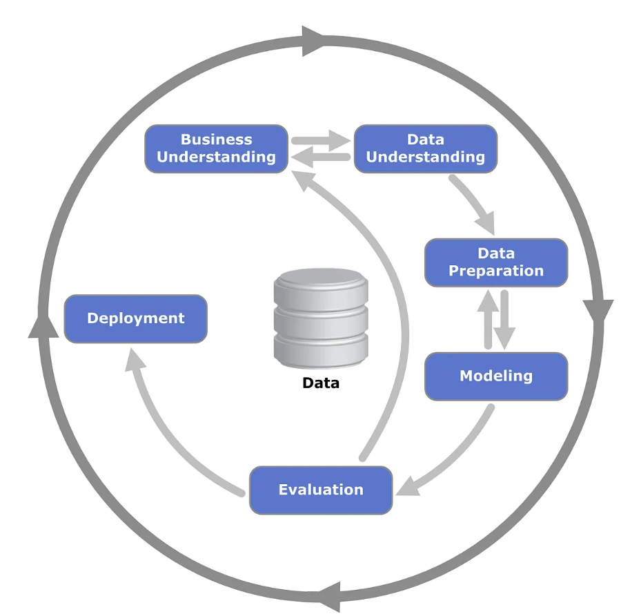

# 📊 Data Toolkit

## 1. Essential Libraries

Data science relies on several key libraries for data manipulation, visualization, and modeling:

- **📌 Numpy** – Numerical computing library
- **📌 Pandas** – Data manipulation and analysis
- **📌 Matplotlib** – Basic data visualization
- **📌 Seaborn** – Statistical data visualization
- **📌 Plotly** – Interactive visualizations
- **📌 Bokeh** – Web-based interactive visualization

---

## 🔍 Data Science Process

### **CRISP-DM Process** *(Cross Industry Standard Process for Data Mining)*

The **CRISP-DM framework** is widely used for extracting insights from data.



### 🔹 1. Business Understanding
- **Problem Statement:** Predict the price of a house.
- **Key Factors Influencing Price:**
  - ✅ Area of the house 🏠
  - ✅ Number of rooms 🏡

### 🔹 2. Data Understanding
- **How does the area of a house affect its price?**
  - Larger area → **Higher price** 📈
  - More rooms → **Price varies accordingly** 🔄

🔎 *Exploratory Data Analysis (EDA) helps us uncover these patterns.*

### 🔹 3. Data Preparation
- Cleaning and handling **missing values** 🔄

### 🔹 4. Modeling
- Selecting and applying **machine learning models** 🤖

### 🔹 5. Evaluation
- Measuring model **performance and accuracy** 📊

### 🔹 6. Deployment
- Making the model available for **real-world use** 🚀

---

## 🏛️ Understanding Libraries

### **What is a Library?**
A **library** is a collection of pre-written code that simplifies programming tasks.

### **Structure of a Library:**

```
+-----------------------+----------------+----------------+-----------------+
| Basic Operations          | Algebra           | Calculus                  |
| (Addition, Subtraction,   | (Linear Algebra)  | (Derivatives, Integrals)  |
| Multiplication, Division) |                   |                           |
+-----------------------+----------------+----------------+-----------------+
|       |                        |                     |                    |
|       ▼                        ▼                     ▼                    |
|   Modules                  Modules               Modules                  |
-----------------------------------------------------------------------------
📦 **Package**: A collection of related modules.
📚 **Library**: A collection of multiple packages.
```

### **Analogy of a Library** 📚
- 📕 **Books** → Packages
- 📖 **Chapters** → Modules
- 📜 **Paragraphs** → Functions

Libraries help developers by offering **pre-built functions**, reducing effort and increasing efficiency. 🚀